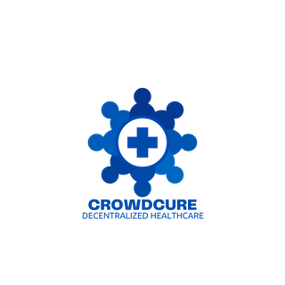
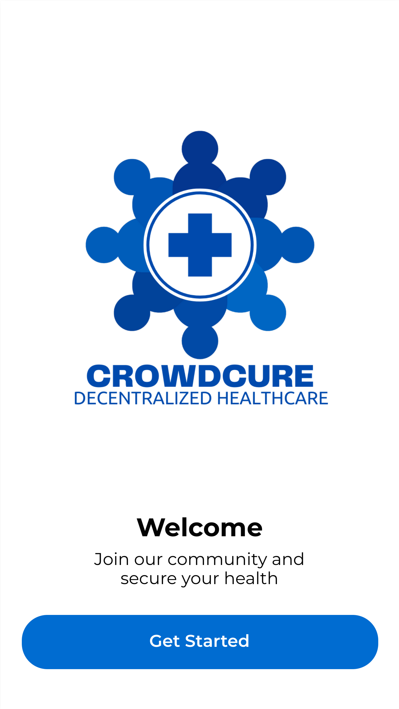
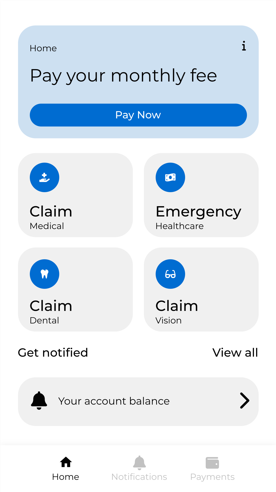
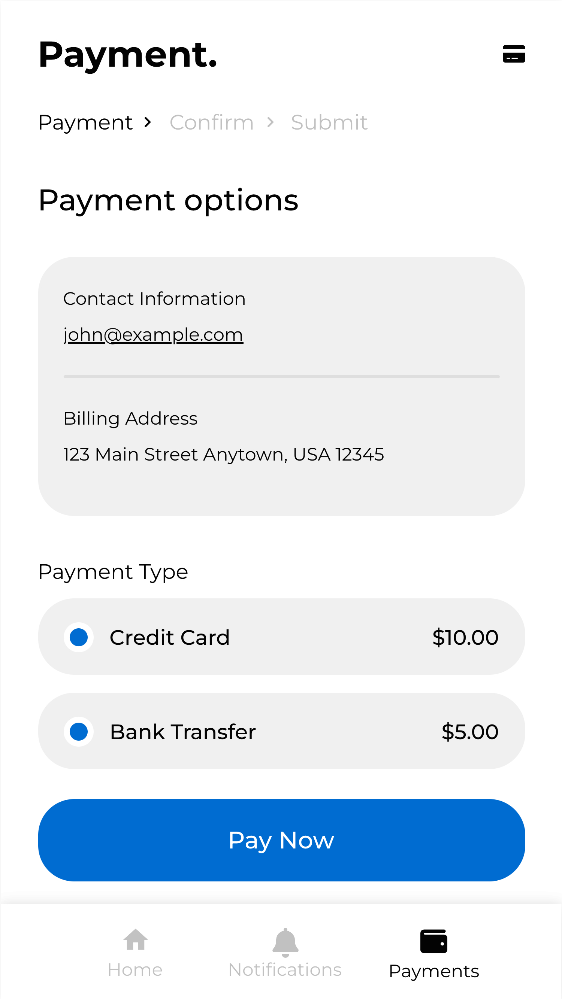

# CrowdCure

  

### Proposed App for UNM/CNM 2023-2024 App Contest 
### By Jett Black (UNM) & Eden Tolesa (UNM)

## Description

Welcome to CrowdCure, where individuals come together to make healthcare accessible and affordable for all. This innovative app empowers users to pool resources and support one another in times of medical need while also revolutionizing the healthcare industry. Here's what you can expect as a CrowdCure user:

1. **Income-Based Contributions:** CrowdCure offers a unique feature that allows users to contribute to campaigns based on their income level. This ensures that everyone can participate and contribute meaningfully, regardless of their financial situation.

2. **Crowdfunding for Healthcare:** CrowdCure allows you to create and contribute to crowdfunding campaigns for medical expenses. Whether it's a sudden illness, a planned procedure, or ongoing treatment, our platform makes it easy to rally support.

3. **Decentralizing Healthcare:** CrowdCure aims to decentralize healthcare by putting the power back into the hands of individuals.

4. **Blockchain-Powered Trust:** Our use of blockchain technology ensures trustless and transparent transactions, eliminating the need for intermediaries and bureaucracy, and making healthcare more accessible and efficient.

5. **No Pre-Existing Condition Questions:** At CrowdCure, we believe that everyone deserves access to healthcare support, regardless of their medical history. We do not ask about pre-existing conditions, ensuring that individuals can seek help without barriers.

6. **Cash Out for Large Medical Needs:** As a registered user of CrowdCure, you have the option to cash out funds from your account when facing significant medical expenses. This feature provides much-needed financial assistance precisely when you need it the most.

7. **Secure and Private:** We prioritize the security and privacy of your personal information. CrowdCure is designed to comply with the highest industry standards, including HIPAA regulations and blockchain technology to ensure your data is protected and transactions are trustless.

8. **Transparent Process:** Our app provides clear and transparent information about each campaign, including the purpose, beneficiary, and funding goal. You can track the progress of campaigns and see how your contributions are making a difference.

9. **Community Support:** CrowdCure is more than just a crowdfunding platform; it's a community of caring individuals. Connect with like-minded users, offer words of encouragement, and share experiences in our supportive community forum.

10. **Spread the Word:** Easily share campaigns on social media and through messaging platforms to broaden the reach and impact of your cause. Every share can make a difference in reaching the funding goal.

11. **Ease of Use:** Our user-friendly interface ensures that creating and managing campaigns, contributing, and navigating the app is intuitive and hassle-free.

12. **Stay Informed:** Receive updates on campaign progress, new features, and important announcements through notifications, so you're always in the loop.

Join CrowdCure today and be part of a community that believes in the power of collective support to transform healthcare experiences and revolutionize the way we access and receive care. Together, we can make a meaningful difference in the lives of those in need.

## Disclaimer

**Important:** Please read this disclaimer before using the CrowdCure healthcare app.

**HIPAA Compliance:** This healthcare app complies with the Health Insurance Portability and Accountability Act (HIPAA) to safeguard the privacy and security of protected health information (PHI). Any unauthorized access, disclosure, or use of PHI is strictly prohibited and may result in legal penalties.

**User Responsibility:** Users are reminded to exercise caution when sharing personal health information through this app. The app's developers and administrators are not responsible for any breach of privacy resulting from user actions or external factors beyond our control.

**Security Measures:** While we have implemented robust security measures, no system is entirely foolproof. It is advised to keep your login credentials secure, log out after each session, and report any suspicious activity immediately.

**Acknowledgment:** By using this app, you acknowledge and agree to abide by HIPAA regulations and the terms outlined in this disclaimer. Failure to do so may result in termination of your account and legal consequences.

## App Preview

  

    
    
    
  

## Audience

As of January 2022, there are currently 28 million uninsured Americans.

CrowdCure is designed for a wide range of individuals who may find themselves in need of financial assistance for healthcare expenses. This includes, but is not limited to:

1. **Individuals with High Medical Costs and low medical cost individuals:** People facing significant medical expenses, such as surgery, ongoing treatments, or specialized therapies.

2. **Those without Adequate Insurance:** Individuals who may have limited or no insurance coverage for certain medical procedures or treatments.

3. **Supportive Community Members:** People who want to contribute and support others in their healthcare journey, regardless of their own financial situation.

4. **Advocates for Healthcare Access:** Individuals who believe in the importance of accessible healthcare and want to be part of a movement that democratizes access to medical support.

5. **Empathetic and Caring Individuals:** People who want to make a positive impact in the lives of others by helping to alleviate the financial burden of healthcare expenses.

6. **Advocates for Decentralized Healthcare:** Those who believe in the potential of decentralized healthcare solutions and want to be part of a community-driven approach.

7. **Users Seeking Confidential Assistance:** Individuals who value the privacy and security of their personal health information and appreciate a platform that does not ask about pre-existing conditions.

8. **People Wanting to Avoid Bureaucratic Hurdles:** Users who prefer a streamlined process that bypasses the bureaucracy often associated with traditional healthcare funding channels.

By providing a platform that focuses on accessibility, transparency, and community support, CrowdCure aims to cater to a diverse user base with a shared goal of making healthcare more affordable and accessible for everyone.

## Founder Bios 

### Eden Tolesa 

Eden Tolesa, a senior at the University of New Mexico, is a passionate student majoring in Political Science and Business. Eden has held severeal positions throughout her undergraduate degree including, but not limited to: Public Affairs Manager for Piru Group, Intern positioning for the Division for Equity and Inclusion at UNM, and Student Senator for Associated Students at the University of New Mexico. 

Eden's dedication led to the successful completion of market research, data analysis, and overall practicality within CrowdCure.

### Jett Black 

Jett Black is a computer science undergraduate student at the University of New Mexico. Jett has a background in undergraduate research, recently performing research for the National Science Foundation in the field of blockchain technology. Overall, Jett holds research interests in the decentralization of commonly centralized technological features and blockchain technology as a whole. Jett currently performs undergraduate research in the realm of threat detection and data visualization inside the Bitcoin network under professor Afsah Anwar, Ph.D.

Jett contributed to this project by spearheading UI/UX design while also developing, overseeing, and theorizing technical strategies and logistics within the application. 

